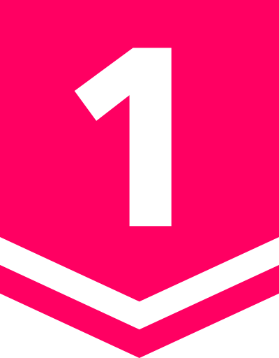

# Problem Solving Resources :computer:

## Overview
:trophy: A collection of algorithm libraries and problem solution, consisting of my code and snippets during our training for competitive programming. Problems mainly come from online judges and problem-solving contests such as
- [**ACM International Collegiate Programming Contest (ICPC)**](https://icpcarchive.ecs.baylor.edu/)
- [**Codeforces**](https://codeforces.com)
- [**VNOJ**](https://oj.vnoi.info/)
- [**Baekjoon OJ**](https://acmicpc.net)
- [**SPhere Online Judge**](https://spoj.com)
- [**HackerRank**](https://hackerrank.com)
- [**CodeChef**](https://codechef.com)

There are also problems from other competitions such as [**Google Code Jam**](https://codingcompetitions.withgoogle.com/codejam), [**Facebook Hacker Cup**](https://www.facebook.com/hackercup), etc..

My CP profile
- Codeforces Handle: [**RaidenEi**](https://codeforces.com/profile/RaidenEi)
- BOJ Handle: [**aresgod**](https://www.acmicpc.net/user/aresgod)
- solved.ac Handle: [**aresgod**](https://solved.ac/profile/aresgod)

## Highlights

For most problems, I will rate their difficulty from **Bronze V**  (easiest) to **Ruby I**  (hardest) based on [solved.ac](https://solved.ac) rating system.

Additionally, I will do my best to include a brief editorial for each problem and categorize them with relevant tags.
