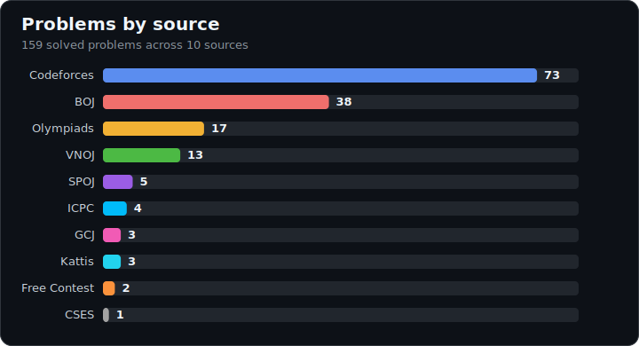
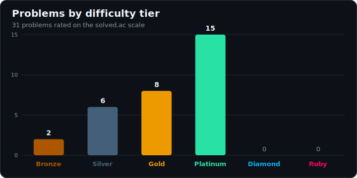
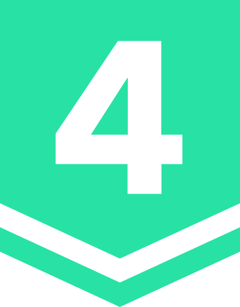

# Problem Solving Resources :computer:

## Overview
:trophy: A collection of algorithm libraries and problem solution, consisting of my code and snippets during our training for competitive programming. Problems mainly come from online judges and problem-solving contests such as
- [**ACM International Collegiate Programming Contest (ICPC)**](https://icpcarchive.ecs.baylor.edu/)
- [**Codeforces**](https://codeforces.com)
- [**VNOJ**](https://oj.vnoi.info/)
- [**Baekjoon OJ**](https://acmicpc.net)
- [**SPhere Online Judge**](https://spoj.com)
- [**Kattis**](https://open.kattis.com)
- [**HackerRank**](https://hackerrank.com)
- [**CodeChef**](https://codechef.com)

There are also problems from other competitions such as [**Google Code Jam**](https://codingcompetitions.withgoogle.com/codejam), [**Facebook Hacker Cup**](https://www.facebook.com/hackercup), etc..

My CP profile
- Codeforces Handle: [**RaidenEi**](https://codeforces.com/profile/RaidenEi)
- BOJ Handle: [**aresgod**](https://www.acmicpc.net/user/aresgod)
- solved.ac Handle: [**aresgod**](https://solved.ac/profile/aresgod)

## Statistics

> :bar_chart: **159 solved problems** across 10 sources. Difficulty tiers cover the **32 problems** rated on the [solved.ac](https://solved.ac) scale (mostly BOJ, ICPC, and olympiad problems).
>
> Charts are generated from the repo by [`scripts/gen-stats.mjs`](./scripts/gen-stats.mjs) — run `node scripts/gen-stats.mjs` to refresh them after adding solutions.

### Problems by source

### Problems by difficulty tier

<!-- latest:start -->
## Latest problems :sparkles:

The 5 most recently added or updated problems (auto-generated):

| Date | Problem | Difficulty | Editorial |
|---|---|---|---|
| 2026-06-23 | [VNOJ VOSSEVEN - Bài toán số 7](./vnoj/VOSSEVEN) |  Bronze 1 | [EN](./vnoj/VOSSEVEN/README.md) · [VI](./vnoj/VOSSEVEN/README-vi.md) |
| 2026-06-20 | [COLOREC](./olympiads/VOI/2011/COLOREC) |  Gold 1 | [EN](./olympiads/VOI/2011/COLOREC/README.md) |
| 2026-06-20 | [SPOJ PT07Y - Is it a tree](./spoj/PT07Y) |  Bronze 1 | [EN](./spoj/PT07Y/README.md) |
| 2026-06-16 | [SPOJ QTREE2 - Query on a tree II](./spoj/qtree2) |  Platinum 5 | [EN](./spoj/qtree2/README.md) |
| 2026-06-16 | [BOJ 3176 - Lubenica](./boj/03176-Lubenica) |  Platinum 4 | [EN](./boj/03176-Lubenica/README.md) |
<!-- latest:end -->

## Highlights

For most problems, I will rate their difficulty from **Bronze V**  (easiest) to **Ruby I**  (hardest) based on [solved.ac](https://solved.ac) rating system.

Additionally, I will do my best to include a brief editorial for each problem and categorize them with relevant tags.

## Editorials :books:

Many solutions ship with a self-contained **editorial** that lives as a `README.md` next to the solution file. Each editorial follows a consistent template:

- **Header** — judge, problem ID, title, and a [solved.ac](https://solved.ac) difficulty badge.
- **Links** — direct links to the original problem statement and source judge.
- **Tags** — the key techniques, linking to the relevant [`library/`](./library) module when one exists.
- **Solution** — a write-up of *why* the approach works (not just what the code does), with LaTeX math, worked examples, implementation gotchas, and a final **complexity** analysis.

Selected problems also include a **Vietnamese translation** as `README-vi.md` alongside the English `README.md`.

> :pencil: Editorials are generated with the repo's `/write-tutorial` helper, which reads the solution, fills the template, and estimates the difficulty tier against the solved.ac scale.
